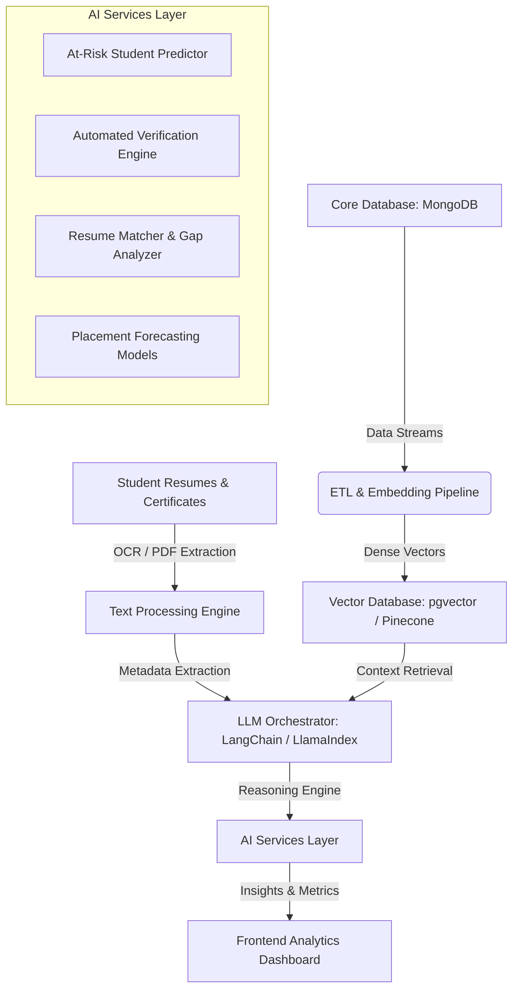

# AI Layer Architecture Blueprint: Future Integration Path

This document outlines the architectural design and system integration path for the future **AI Layer** (Phase 14) of the EduPulse Intelligence Platform. 

---

## 1. Core Use Cases

### A. Predictive At-Risk Student Modeling
- **Objective**: Proactively identify students at risk of academic failure, attendance default, or placement ineligibility.
- **Approach**:
  - Run offline monthly training loops using student historical records (CGPA progression, course-wise attendance drop-offs, backlog counts).
  - Use classification algorithms (Random Forests, XGBoost) to output a **Risk Score (0 - 100)** and highlight contributing factors (e.g., "70% risk due to a 15% drop in Database Systems attendance over 3 weeks").

### B. Automated Verification Engine (OCR + NLP)
- **Objective**: Automate the verification of uploaded student achievements (certificates, internships, research papers).
- **Approach**:
  - Integrate an OCR processor (e.g., Tesseract or AWS Textract) to convert uploaded PDF/image proof into structured text.
  - Route the extracted text and the student-provided title/issuer to a lightweight LLM (e.g., Gemini Flash or GPT-4o-mini).
  - LLM evaluates semantic correctness and outputs a confidence score. If confidence is > 90%, mark as `VERIFIED` automatically; otherwise, flag for manual review in the Faculty Queue.

### C. Automated Resume Matching & Skill Gap Analysis
- **Objective**: Help students align their profiles with target corporate recruitment requirements.
- **Approach**:
  - Parse student resumes and LinkedIn/GitHub links to build a semantic profile.
  - Compare the profile embedding with company job descriptions (JDs) in the `Company` collection.
  - Deliver action-oriented recommendations (e.g., "To qualify for the upcoming Oracle Java developer drive, complete a course on Spring Boot and add it to your skills profile").

---

## 2. Technology Stack & Integration Details

| Layer | Component | Recommended Technology | Description |
| :--- | :--- | :--- | :--- |
| **Orchestration** | LLM Framework | LangChain / LlamaIndex | To manage prompt templates, retrieval-augmented generation (RAG), and agentic tool routing. |
| **Model Hosting** | Inference APIs | Gemini Pro / OpenAI GPT-4o | Managed endpoints for high-speed, secure semantic evaluation and summary generation. |
| **Vector Search** | Vector Database | Pinecone / MongoDB Atlas Vector Search | To store and retrieve dense vector representations of student profiles and resumes. |
| **Data Pipelines** | ML Frameworks | scikit-learn / TensorFlow | For traditional classification models (predicting risk and recruitment probabilities). |

---

## 3. Data Flow & RAG Pattern (Retrieval-Augmented Generation)

When a Placement Officer or Admin queries the system with a natural language query (e.g., *"Show me third-year students who have experience in Docker and CGPA above 8.5"*):
1. **Query Embedding**: The user's query is converted to a vector representation using an embedding model (e.g., `text-embedding-3-small`).
2. **Vector Similarity Search**: The vector database searches student profile embeddings to find the nearest neighbors matching "Docker".
3. **Metadata Filtering**: The system applies hard database filters (e.g., `year === 3` and `cgpa >= 8.5`) to prune the candidates.
4. **LLM Prompt Synthesis**: The structured information of the matching candidates is fed into the LLM context prompt.
5. **Response Generation**: The LLM compiles a natural language summary of the results with structured recommendations for the Placement Officer.

---

## 4. Privacy, Ethics & Compliance (FERPA & GDPR)
- **PII Anonymization**: Before sending student data to third-party LLM APIs, all personally identifiable information (Name, Email, Phone, Roll Number) must be hashed or removed.
- **Opt-In Policy**: Students must explicitly opt-in to have their resumes parsed by AI matching algorithms.
- **Auditable Decisions**: Any auto-rejected or auto-verified certificate must retain the model's confidence scores and prompt logs for auditing by the respective HOD.
